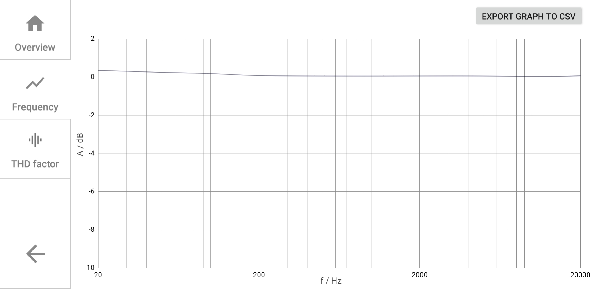

# Audio path analyzer app

This is Android app used to remotely control and use the https://github.com/KlemenDEV/AudioPathAnalyzer project.
Recommended use case is Raspberry Pi loaded with Audio path analyzer binary and WiFi hotspot for the
connectivity.

Measurement results dashboard panel screenshots:

Bode diagram display:

# Audio path analyzer

This project aims to develop an audio analyzer for analyzing audio transport path quality using criteria such as:
* First-order frequency response
* Harmonic distortion properties (THD)
* (DC offset)

Core project on https://github.com/KlemenDEV/AudioPathAnalyzer
